<h1 name="user-content-readme-top" align="center">TodoNotes plugin for Kanboard</h1>

<p align="center">
    <a href="https://github.com/imfx77/kanboard-plugin-TodoNotes/releases">
        
    </a>
    <a href="https://github.com/imfx77/kanboard-plugin-TodoNotes/blob/master/LICENSE" title="Read License">
        
    </a>
</p>
<p align="center">
    <a href="https://github.com/imfx77/kanboard-plugin-TodoNotes/releases">
        
    </a>
    <a href="https://github.com/imfx77/kanboard-plugin-TodoNotes/releases">
        
    </a>
    <a href="https://github.com/imfx77/kanboard-plugin-TodoNotes/releases">
        
    </a>
    <a href="https://github.com/imfx77/kanboard-plugin-TodoNotes/releases">
        
    </a>
</p>
<p align="center">
    <a href="https://github.com/imfx77/kanboard-plugin-TodoNotes/stargazers" title="View Stargazers">
        
    </a>
    <a href="https://github.com/imfx77/kanboard-plugin-TodoNotes/discussions">
        
    </a>
    <a href="https://github.com/imfx77/kanboard-plugin-TodoNotes/compare">
        
    </a>
    <a href="https://github.com/imfx77/kanboard-plugin-TodoNotes/compare">
        
    </a>
</p>
<p align="center">
    <a href="https://github.com/kanboard/kanboard" title="Kanboard - Kanban Project Management Software">
        
    </a>
</p>

---


The plugin allows to keep TODO-style notes on every KB project and as standalone lists.
The notes that may appear unsuitable for creating board tasks are totally fine for a custom TODO list.
They are easy and fast to create, change and rearrange, with convenient visual aids and multiple useful features.

This is an alternative way to organize data and tasks.
It does not interfere with nor covers the whole complexity and functionality of KB tasks,
but rather is aimed to be fast, lightweight and simplistic for managing
smaller personal tasks in the form of TODO-lists.

Regardless of the types of note lists that you would use, your notes are ONLY available to you
to view, edit and manage. You can, of course, consider sharing any of them with other users
with explicit View or Edit permissions per user, and also remove those permissions at any time later.

<p align="right">[<a href="#user-content-readme-bottom">&#8595; Bottom</a>] [<a href="#user-content-readme-top">&#8593; Top</a>]</p>

## Features and Usage (with Screenshots)

While I believe that the most of the features and functionality of the plugin are quite simple straightforward and intuitive,
and even though there are self explanatory hints and hover helpers in most places to aid the users
=> it is still better to have all the features thoroughly described in one place,
so to avoid inconsistencies and possible confusion.

Might you excuse my custom dark theme and the rainbow colored categories in the screenshots provided throughout this section,
yet those demonstrate very well the visuals of the plugin ✨😝

Also, pls beware, that the screenshots of editing and viewing MD areas,
utilize the [WysiwygMDEditor plugin](https://github.com/imfx77/kanboard-plugin-Wysiwyg-MD-Editor),
thus may not look in the same way at your side!

All features are accessible via the `Project View` or the `Dashboard View` of KB.  

<p align="right">[<a href="#user-content-readme-bottom">&#8595; Bottom</a>] [<a href="#user-content-readme-top">&#8593; Top</a>]</p>

### 🔳 Project and Dashboard Views

<details>
<summary><strong>Project Board View</strong></summary>

For each KB project there are two ways to reach the TodoNotes:
* a button in the project header
* an item in the project dropdown menu (that also shows current stats of the project notes)


</details>

<details>
<summary><strong>Project Notes View</strong></summary>

This is the corresponding view of the associated project notes.
You can perform all manipulations for the notes in this project directly from here.
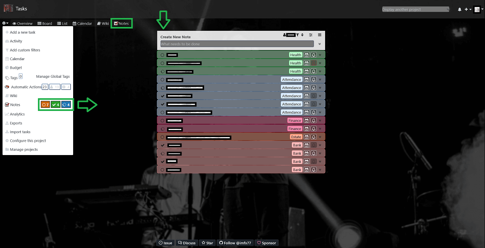

</details>

<details>
<summary><strong>Dashboard Notes View</strong></summary>

However, accessing notes list through the `Dashboard > My notes`, gives you the full functionality of the plugin.
You can see and manage from there all the lists that are available to you.
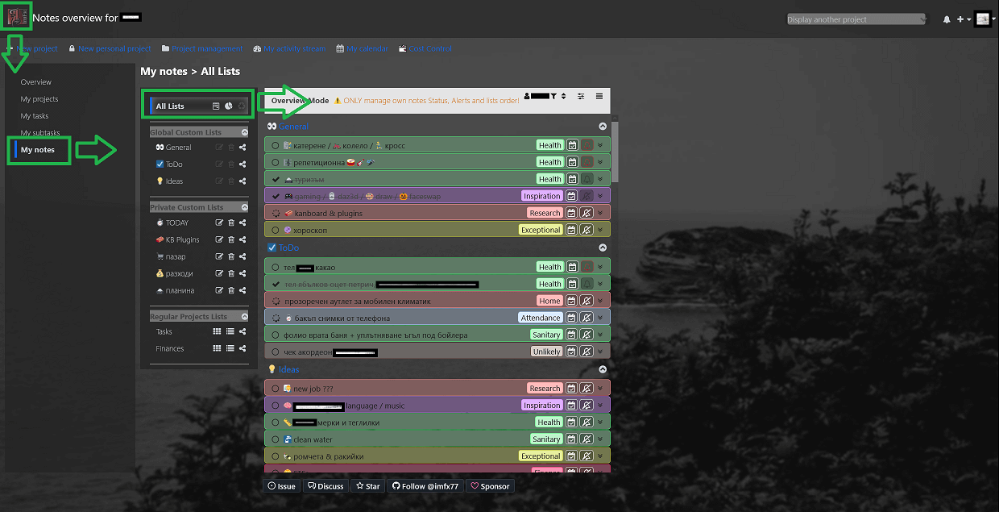

</details>

<p align="right">[<a href="#user-content-readme-bottom">&#8595; Bottom</a>] [<a href="#user-content-readme-top">&#8593; Top</a>]</p>

### 🔳 Manage Notes

<details>
<summary><strong>Create a Note</strong></summary>

Suppose we have a new empty list.
* Creating a note is as simple as typing something and pressing ENTER.
(_Attention_: for mobile you will still have to click the _Save Note_ button!)
* Optionally, you can press TAB or the _Toggle Details_ button, to input note category and details.
If you don't, you can still change those later.
* Finally, to save everything either press the _Save_ button or simply TAB from the editing details area.


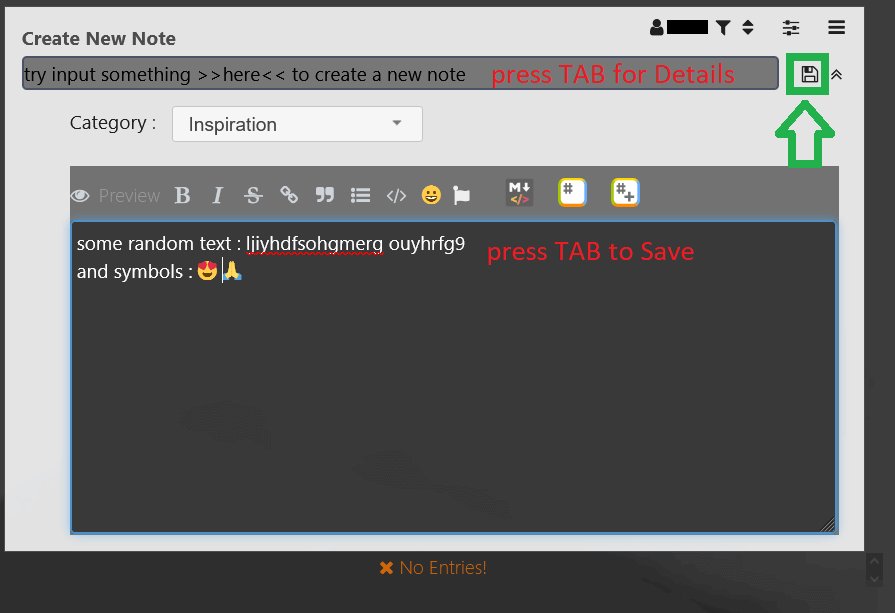

</details>

<details>
<summary><strong>View Note Details</strong></summary>

In a similar fashion, to view/hide note details:
* click the _Toggle Details_ button
* or double-click / double-tap in on the empty area of the note
* clicking the category label or date icon in collapsed view will also open the detailed view


</details>

<details>
<summary><strong>Edit Note Details</strong></summary>


To change any of the note's elements just click on:
* (1) the title label - change title, press ENTER
* (2) the category dropdown - simply select another category
* (3) the _Edit Note Details_ button - change details, press TAB
* (4) the _Status_ button - clicking toggles between Open / In Progress / Done states

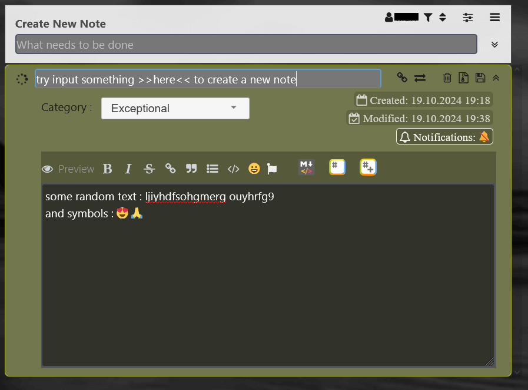

</details>

<details>
<summary><strong>Manually Reorder Notes</strong></summary>

You can also rearrange multiple notes in a list by simple drag-n-drop,
while any note can be collapsed or expanded at your wish.

_Attention_, for mobile there is an explicit button in the note's toolbar to serve as a `reorder handle`
=> use it specifically for dragging the note, as the generic behavior of drag is to swipe the page contents!

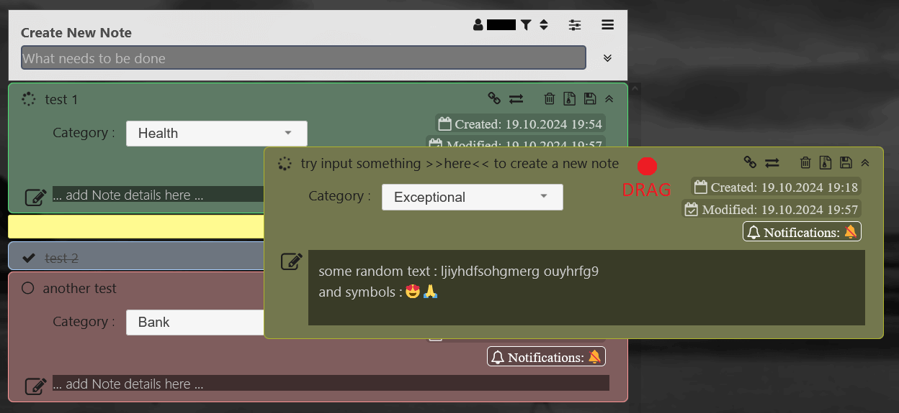

</details>

<details>
<summary><strong>Note Toolbar Actions</strong></summary>

On the next picture, the note toolbar buttons are listed from left to right as follows:
* _Get Link to Note_ - copy a link to this note to the clipboard
* _Move Note to Project_ - transfers this note to any other of the available lists
* _Create Task from Note_ - apparently, it is only available for notes in [Regular lists](#-manage-lists),
creates a task on the corresponding KB project with specific Category, Column, Swimlane
* _Delete Note_ - permanently remove the note from the list!
* _Move Note to Archive_ - archives the note (in separate DB table)
* _Save Note_ - store all note changes to the DB


</details>

<p align="right">[<a href="#user-content-readme-bottom">&#8595; Bottom</a>] [<a href="#user-content-readme-top">&#8593; Top</a>]</p>

### 🔳 Manage Lists

<details>
<summary><strong>Types of Lists</strong></summary>


These are the list types that you can have:
* **Regular** - this is an automatic list that is available for every KB project that you participate in.
Beware that if you lose your access to the KB project you will also lose access to the corresponding Notes List
even though all the notes will remain intact. There might be multiple users that are members of the KB project
and each of them will have this list, but they cannot see each others notes unless they explicitly share them.
* **Custom** - these lists are standalone, they can be only created accessed and manipulated through the `Dashboard > My notes`
interface of the TodoNotes plugin. They are highly flexible and customizable to match various purposes.
  * **Global** - those lists are globally accessible for all users, and much like the **Regular** lists
every user can see and manage just his own notes. The specific is that **Global Custom** lists can be managed by Admin only
(create/rename/delete/reorder), and the users can manipulate their own notes and consider sharing them.
The plugin initially pre-creates `Global Notes` and `Global TODO` global lists, you can leave them or remove them at wish.
  * **Private** - as the name suggests those are the personal user lists. Everyone can create and manage any number of private lists as he needs.
They are visible only to the owner (unless shared). Those would be the most expendable lists as they would come and go on demand.
  * **Shared** - those are other users' private list that have been shared with you. You can access them
with the corresponding Vew/Edit permissions. Apparently, with View permission you see a readonly list,
and with Edit permission you can touch the notes on user's behalf.

</details>

<details>
<summary><strong>Manage Custom Lists</strong></summary>

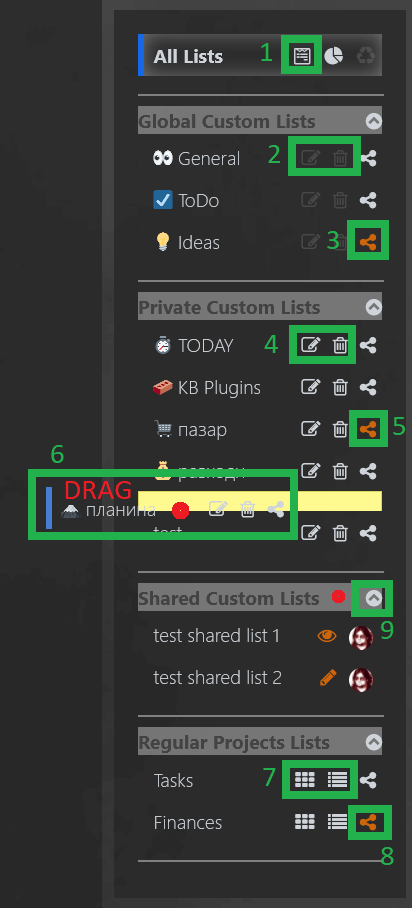

As numbered on the above picture, these are the manipulations to list that you can do:
* (1) _Create custom note list_ - if you have Admin privileges, you can create **Global** lists, otherwise only **Private**
* (2) _Rename/Delete custom global note list!_ - Admin only
* (3) _Sharing Permissions_ - if button is highlighted there are existing permissions for this list.
Sharing permission to a specific user will only give him access to your notes, other users' notes in the global list are theirs to share.
* (4) _Rename/Delete custom private note list_ - mangle them as you like it, the list panel will adjust its width
* (5) _Sharing Permissions_ - if button is highlighted there are existing permissions for this list.
Since the **Private** list contains your notes only, a sharing permission actually exposes the entire list to another user,
and he will see it as a standalone list in his `Shared Custom List` group in the tabs panel.
* (6) Reorder **Private** list by dragging. Same thing applies for **Global** lists too, it just requires Admin privileges.
_Attention_, for mobile there is an explicit `reoder handle` to drag the lists around!
* (7) The **Regular** list being bound to actual KB projects are not really manipulatable,
you can just go to their Board or Task List views.
* (8) _Sharing Permissions_ - works as for **Global** list.
* (9) Collapse/Expand the list groups - as expected, click on the arrows, or double-click the group title.
The collapse/expand state of each group is remembered and the visuals will remain as you set them.

</details>

<details>
<summary><strong>Share Notes with other Users</strong></summary>

To share your notes from a **Global/Regular** list or to share a whole **Private** list
click the corresponding _Sharing Permissions_ button (1) and it will bring up
a page that lists users and permissions.

For each user of interest select the desired permission (2) and press the _Set_ button (3).
When the list is longer, please scroll to find desired users. Operate them one by one.
If you want to remove the sharing permissions, simply select the `[none]` option.

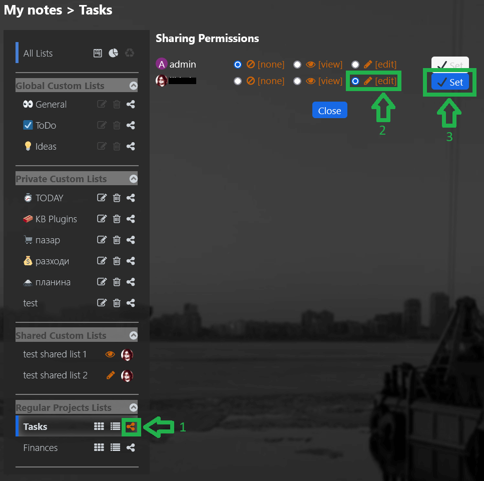

</details>

<p align="right">[<a href="#user-content-readme-bottom">&#8595; Bottom</a>] [<a href="#user-content-readme-top">&#8593; Top</a>]</p>

### 🔳 Overview and Archive

<details>
<summary><strong>Overview Mode</strong></summary>

When you open the `Dashboard > My notes` by default you land on the `All Lists` item
which effectively represents the **Overview Mode**. Its idea is to be able
to quickly browse and review all available notes from all available owned lists (according to the set filters, of course).
The order of lists in the overview follows their order from the tabs pane on the left.

You can surely expand and collapse notes' details, but you are only allowed
to change note _Status_ and _Alert_ and to reorder notes within a list.

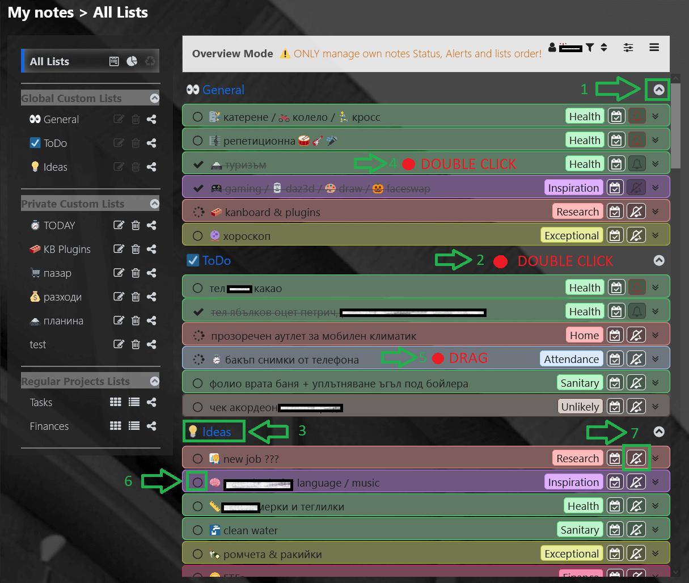

As numbered on the picture the following actions regard the lists:
* (1) collapse / expand specific list
* (2) double-click on the empty area to collapse / expand specific list
* (3) click to go to specific list (same as clicking on its tab in the left pane)

And the rest of them regard the notes:
* (4) double-click empty area of note to expand / collapse note details
* (5) drag note to reorder within the specific list
* (6) toggle note _Status_
* (7) set note _Alert_

</details>

<details>
<summary><strong>Archive Mode</strong></summary>

There is a special filter in the [List Toolbar > Filters](#-list-toolbar) (1)
that is called `Archive View` (2).
It effectively switches the entire list view mode as it shows the archived notes for this list
(which are technically being kept in a separate DB table form the active ones).

When notes are archived they lose their status and become unmanageable in any way.
You can browse and review their data, but the only actions (3) you can perform with them are:
* delete them permanently
* or restore them as active notes


</details>

<details>
<summary><strong>Archive Overview Mode</strong></summary>

Well, since the `Archive View` filter is also available in `Overview Mode`
this allows to have an overview of all archived notes from all available lists.
Yet, you can only browse and review them. If you want to manipulate the archived notes
you have to select a specific list and turn on its `Archive View` from filter settings.

</details>

<p align="right">[<a href="#user-content-readme-bottom">&#8595; Bottom</a>] [<a href="#user-content-readme-top">&#8593; Top</a>]</p>

### 🔳 Statistics

<details>
<summary><strong>Toggle Lists Stats</strong></summary>

By using the _Show Stats_ button you can toggle ON / OFF the visibility of
the statistics widgets for all lists. They show the number of Open / In Progress / Done
notes for each list, and a total on top.

_Attention_, if you are viewing someone else's [Shared notes](#-manage-lists)
for a specific list, the shown stats will be grayed out to denote that those are not the counts of your notes
and that they don't contribute to the total!

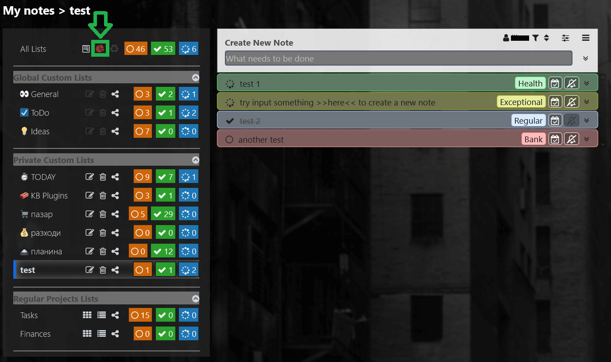

</details>

<details>
<summary><strong>Dynamic Update of Stats</strong></summary>

You can see the counts updating immediately as you change the _Status_ of notes.

When the `In Progress` count for a list is `0` then the widget icon would stop spinning to avoid drawing unnecessary attention.

</details>

<p align="right">[<a href="#user-content-readme-bottom">&#8595; Bottom</a>] [<a href="#user-content-readme-top">&#8593; Top</a>]</p>

### 🔳 List Toolbar

<details>
<summary><strong>Users</strong></summary>

The **User** menu (1) shows the currently selected user whose note are being viewed.
The default user (2) is always on the top of the menu, the icon on his right (3) shows its role or permissions.
* The _Sharing Permissions_ section of the menu appears for **Global/Regular** lists.
It will hold users that have shared their notes for this list with you (4) along with their corresponding permissions.
* For the **Private/Shared** lists there is always a single user - the list OWNER - you or the sharer.

When there are multiple users in this menu to select from, the selected user is highlighted in RED.
Switching users will switch the set of notes, and the list may become readonly depending on the permissions.

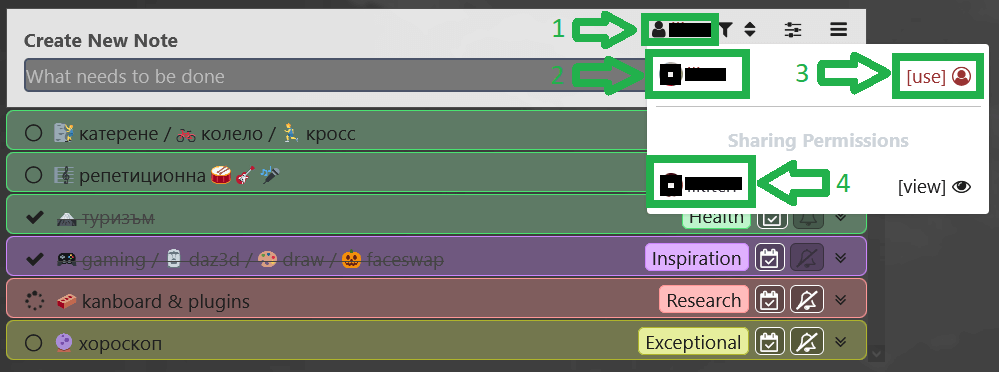

</details>

<details>
<summary><strong>Filters</strong></summary>

The **Filter** menu (1) contains options to show/hide notes by _Status_.
You can toggle multiple options, highlighted in RED. On the example picture,
the Done notes are excluded (2).

The last item in the menu is `Archive View` (3). It will actually switch the list to [Archive Mode](#-overview-and-archive)
which allows browsing and managing its archived notes (if any). Toggling `Archive View` OFF again, will bring you back
to the normal view.


</details>

<details>
<summary><strong>Sorting</strong></summary>

The **Sort** menu (1) contains options to order the notes in the list.
The selected option is highlighted in RED.

The `Manual Order` option (2) is a special one, it does NOT sort anything but rather allows you to manually reorder notes by dragging.
If any other option is selected, like in the example `Sort by Status` (3), the notes will get sorted along the selected condition
and the list will not allow dragging the notes.

Some options are context dependent (e.g. Overview, Archive, etc).
On the example picture the item `Sort by Date Restored` (4) will disappear in **Archive Mode**
and will be replaced by `Sort by Date Archived`.


</details>

<details>
<summary><strong>View Options</strong></summary>

The **View** menu (1) presents some visual options.
When an option is turned ON it is highlighted in RED.
* the `Colorize by Category` (2) switches on/off the category colors in notes
* the `Use Standard Status Marks` (3) switches between two sets of marks for the _Status_ buttons


</details>

<details>
<summary><strong>Actions</strong></summary>

On the **Actions** (1) from top to bottom are:
* _Expand all Notes_ - expands all notes' details, desktop shortcut key [+]
* _Collapse all Notes_ - collapses all notes' details, desktop shortcut key [-]
* _Note Stats_ - shows a pie chart of the notes counts
* _Create Report_ - generates a flat expanded non-editable view of the note list, can filter by specific category
* _Archive ALL Done Notes!_ - moves in bulk all Done notes to Archive
* _! Delete ALL Done Notes!_ - permanently removes in bulk all Done notes
* _View README_ - view this README document online

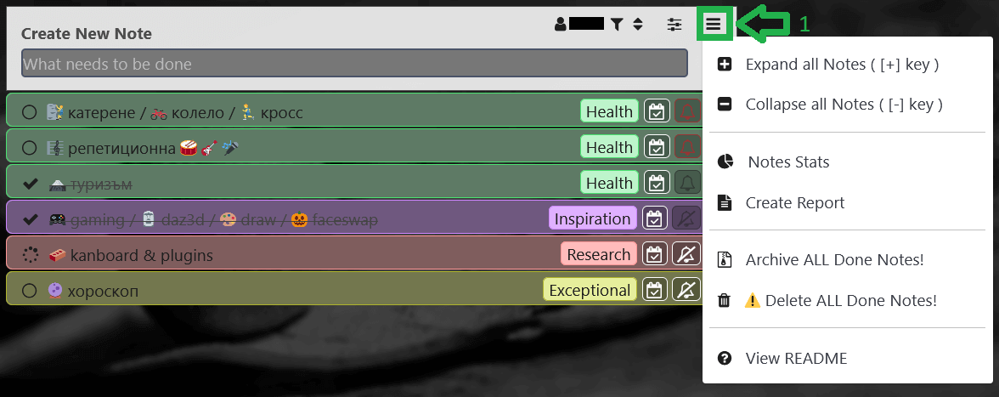

</details>

<details>
<summary><strong>Keeping the Settings</strong></summary>

All the settings from the above menus are attempted to be remembered for each list separately,
thus providing maximum customization to the user in every single client.
The persistence mechanism uses the SESSION variable while the user is online
and COOKIES to store the settings in the client browser between the sessions.

If you have disabled cookies for the KB domain, then every time you start a new session
the settings for all lists will be default, and whatever you set during the session
will be lost when you disconnect or close the client.

</details>

<p align="right">[<a href="#user-content-readme-bottom">&#8595; Bottom</a>] [<a href="#user-content-readme-top">&#8593; Top</a>]</p>

### 🔳 Automatic Refresh

<details>
<summary><strong>Simultaneous Editing and Watching</strong></summary>

Different scenarios might occur, in which simultaneous editing from multiple parties,
or simultaneous editing from one party and watching from other parties, will concern the same data - a note or a whole list.

* I might view/edit the same note/list both in my desktop and mobile browser on different devices.
* I might have shared a note list for view/edit, and me and the other user are trying to view/edit some note at the same time.
* Or even I just have a dedicated screen that is permanently open to some list in order to continuously keep track of tasks.

In all the cases, a mechanism is needed to keep the data up to date,
and propagate any remote changes to all watcher/editor clients.

</details>

<details>
<summary><strong>Smart Minimal Refresh</strong></summary>

Normally you would only see this icon blink for a moment in the bottom right corner, it is auto refresh.


Every 15 seconds the client would ask the server if there is any change
since the last time the page was updated. It would then receive a collection of timestamps
to denote last changes in several aspects, to drive partial or full refresh if necessary,
and to update the page timestamp to the latest.

If the page is not visible or not in focus, the 15 seconds cycle is suspended
and the AutoRefresh waits until focus is gained again, thus sparing unnecessary request to the server.

_Attention_, this is NOT a collision resolving mechanism. It ONLY ensures that if there was
a nearly simultaneous change of the same data from multiple parties, they all will receive and see
the final change in a quite short interval. That is just meant to prevent continuous and large data desync.

</details>

<details>
<summary><strong>Downside of AutoRefresh</strong></summary>

You might be doing some changes when AutoRefresh happens, and you will lose them as you get interrupted.
But then, again, the AutoRefresh initially happened because the data you are editing was changed while you are still doing it.
And as a matter of precedence, whichever the first change submitted it triggers the refresh to get itself propagated and keep a consistent state of the data.

</details>

<p align="right">[<a href="#user-content-readme-bottom">&#8595; Bottom</a>] [<a href="#user-content-readme-top">&#8593; Top</a>]</p>

### 🔳 Notifications

<details>
<summary><strong>Alerts per Note</strong></summary>

The plugin allows you to configure an alert for each separate note.
You can open the notification setup dialog either by clicking the `Notifications` label (1)
in the detailed note view or by directly clicking the alert button on the toolbar (2) while note is collapsed.

As you may notice, the alert icon indicates the state of the alert:
* **slashed white bell** - no alert configured
* **white bell** - configured alert, pending
* **slashed grayed bell** - no alert configured, disabled due Done state
* **grayed bell** - configured alert, disabled due Done state
* **red bell** - configured alert, overdue

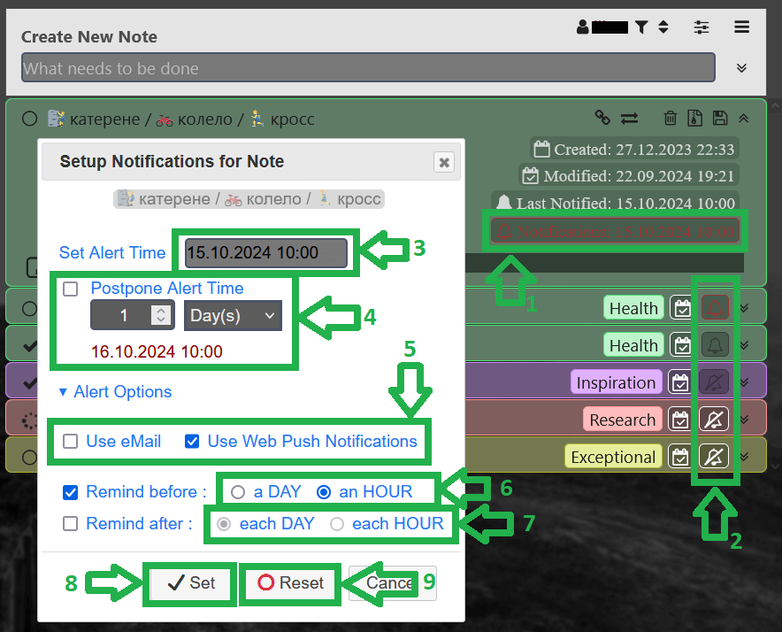

</details>

<details>
<summary><strong>Setup Alert</strong></summary>

On the above picture, in the dialog, you can select the Date/Time in two ways:
* either by explicitly using the calendar control (3)
* or by clicking the `Postpone` checkbox (4) and using an offset to the currently set date
(in order to use the calendar again you must explicitly uncheck `Postpone`)
  
The `Alert Options` determine how to execute the notifications.
You must first select the type of the notification (5).
If you choose none => then no notification will be triggered,
this could be useful when you need to just temporarily stop the notification trigger without resetting its parameters.
* **eMail** - uses the KB backend to send mails
* **WebPN** - the plugin provides means to push browser notifications on multiple clients subscribed
* you can check both of them, of course

The `Remind` options allow for additional notifications, respectively:
* **Remind before** (6) - a single reminder prior to the alert date
* **Remind after** (7) - infinite repetitive reminders after the alert date

And finally, use **Set** button (8) to apply all the changes.
Or you can **Reset** (9) the entire alert, which will remove all settings and will disable the notification trigger.

</details>

<details>
<summary><strong>Allowing EMails and WebPNs</strong></summary>

To be able to use **eMail** notifications you need two things:
* a valid email configured in your KB profile
* the plugin utilizes the KB backend for sending mails - so, you need to have the
[KB server settings](https://docs.kanboard.org/v1/admin/email/#server-settings)
properly configured to allow this

For the **WebPNs** to work you must enable in your browser(s) the push notifications
for the KB domain that you use. Check how to do this for your specific browser,
then just load any page that shows a TodoNotes list, and you will be automatically subscribed.
* You may subscribe in several browsers on different devices (including mobile), and when the alert is due
you will get notified on all of them.
* If you wish to stop receiving **WebPNs** on a specific device,
simply disable the notifications for the KB domain in the browser of use on that specific device.

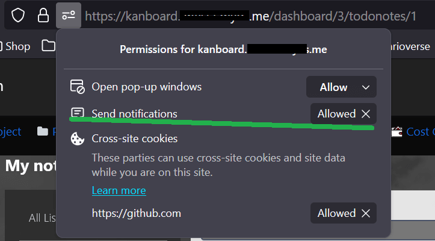

</details>

<details>
<summary><strong>Heartbeat to Schedule Alerts</strong></summary>

Finally, for any notification to be triggered, we need a scheduler that will periodically check which of the alerts are due.
KB provides a mechanism to schedule jobs (e.g. the **“Daily background job for tasks”**) through
[cronjob configuration](https://docs.kanboard.org/v1/admin/cronjob/).

The **cron** file for the daily event usually looks something like this:

```bash
0 8 * * * cd /var/www/app && ./cli cronjob >/dev/null 2>&1
```

Unfortunately, a trigger once a day is quite far from what we want for notifications.
Hence, the plugin provides a specific command to trigger a heartbeat for notifications.
It would look like this in the **cron** file:

```bash
*/15 * * * * cd /var/www/app && ./cli TodoNotes:NotificationsHeartbeat
```

As you can see, the notifications will be triggered in chunks depending on the interval and NOT on the exact note alarm time.
A fair interval to set is **15 minutes**.
* The smaller the value (e.g. 1 min) => the more precise the alert trigger, but more burden on the server.
* The lager the value (e.g. 30 mins) => more relaxed on the server, but greater delay for notifications.

Additional delays in delivering the **WebPNs** might take place depending on the specific platform, client, and the media transport.

If you don't have access to the system beneath KB, or if you are uncomfortable to mangle it - the plugin
provides one more way to receive a heartbeat. Yet it is NOT recommended unless absolutely no other options.
* The ServiceWorker on the client that handles the push notifications from the server sends back a periodic emulated heartbeat.
* Thus, having clients performing requests to the server in a way provides soft heartbeat, but sporadic in nature as the clients connect and disconnect.
* In order to emulate a stable soft heartbeat, you need to **keep alive a dedicated browser client** on some device, and a page with TodoNotes list opened in it, for the SW to be active.

The heartbeat defined through the **cron** command has higher priority anyway.
So even if there are multiple clients generating a soft heartbeat, this won't burden the server, you can safely have the both.

</details>

<p align="right">[<a href="#user-content-readme-bottom">&#8595; Bottom</a>] [<a href="#user-content-readme-top">&#8593; Top</a>]</p>

## Installation & Compatibility

<details>
<summary><strong>Installation</strong></summary>

* Install via the **Kanboard Plugin Directory** or see [INSTALL.md](INSTALL.md)
* Read the full [**Changelog**](changelog.md "See changes") to see the latest updates

</details>
<details>
<summary><strong>Compatibility</strong></summary>

* Requires [Kanboard](https://github.com/kanboard/kanboard "Kanboard - Kanban Project Management Software") ≥`1.2.33`
* **Other Plugins & Action Plugins**
  * _No known issues_
* **Core Files & Templates**
  * `0` Template overrides
  * `5` _New database tables_ to serve the purposes of the **TodoNotes plugin**

</details>
<details>
<summary><strong>Translations</strong></summary>

* _Translation for `en_US` is the default_, currently there are no other translation packs.

</details>

<p align="right">[<a href="#user-content-readme-bottom">&#8595; Bottom</a>] [<a href="#user-content-readme-top">&#8593; Top</a>]</p>

## Authors & Contributors

* [Im[F(x)]](https://github.com/imfx77) - Author
* Contributors welcome _for translations_ !

<p align="right">[<a href="#user-content-readme-bottom">&#8595; Bottom</a>] [<a href="#user-content-readme-top">&#8593; Top</a>]</p>

## Credits & References

This project was initially forked from the [BoardNotes](https://github.com/aljawaid/BoardNotes) plugin and I tried contributing to it for a while.
Eventually, things grew much bigger, this repo was split, and its current code has nothing in common with the original.
Yet, the following credits are mentioned out of courtesy:
* [TTJ](https://github.com/ThomasTJdev) (c) 2016-2023
* [aljawaid](https://github.com/aljawaid) (c) 2023

<p align="right">[<a href="#user-content-readme-bottom">&#8595; Bottom</a>] [<a href="#user-content-readme-top">&#8593; Top</a>]</p>

## License

* This project is distributed under the [MIT License](LICENSE "Read The MIT license")

<p align="right">[<a href="#user-content-readme-top">&#8593; Top</a>]</p>

---

<p align="center">
    <a href="https://github.com/imfx77/kanboard-plugin-TodoNotes/stargazers" title="View Stargazers">
        
    </a>
    <a href="https://github.com/imfx77/kanboard-plugin-TodoNotes/forks" title="See Forks">
        
    </a>
    <a href="https://github.com/imfx77/kanboard-plugin-TodoNotes/blob/master/LICENSE" title="Read License">
        
    </a>
    <a href="https://github.com/imfx77/kanboard-plugin-TodoNotes/issues" title="Open Issues">
        
    </a>
    <a href="https://github.com/imfx77/kanboard-plugin-TodoNotes/issues?q=is%3Aissue+is%3Aclosed" title="Closed Issues">
        
    </a>
    <a href="https://github.com/imfx77/kanboard-plugin-TodoNotes/discussions" title="Read Discussions">
        
    </a>
    <a href="https://github.com/imfx77/kanboard-plugin-TodoNotes/compare/" title="Latest Commits">
        
    </a>
</p>

<a name="user-content-readme-bottom"></a>
